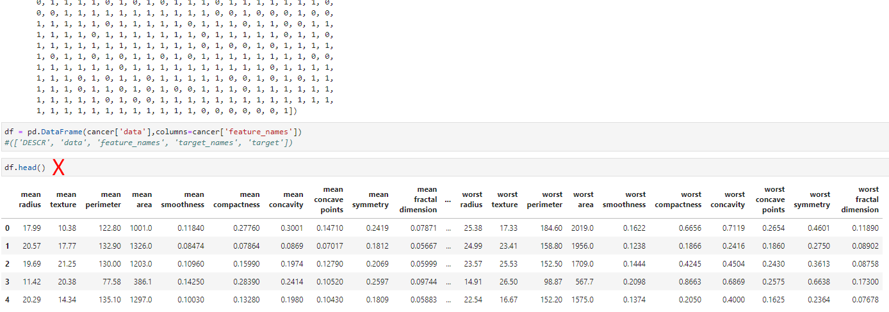
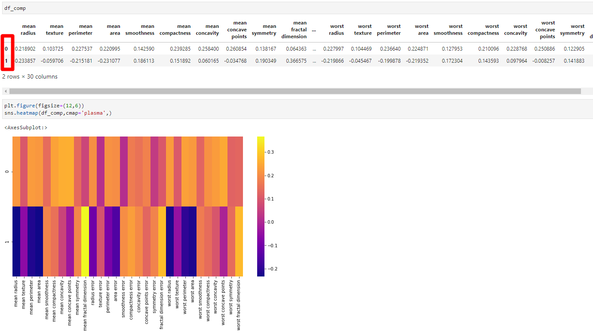

# Principal-Component-Analysis-Unsupervised

# Original X has 30 features

# Reduced to 2 components

Scale data

PCA with Scikit Learn uses a very similar process to other preprocessing functions that come with SciKit Learn. We instantiate a PCA object, find the principal components using the fit method, then apply the rotation and dimensionality reduction by calling transform().

We can also specify how many components we want to keep when creating the PCA object.

Plot these two dimensions out with .scatter.

The components correspond to combinations of the original features, the components themselves are stored as an attribute of the fitted PCA object: pca.components_
